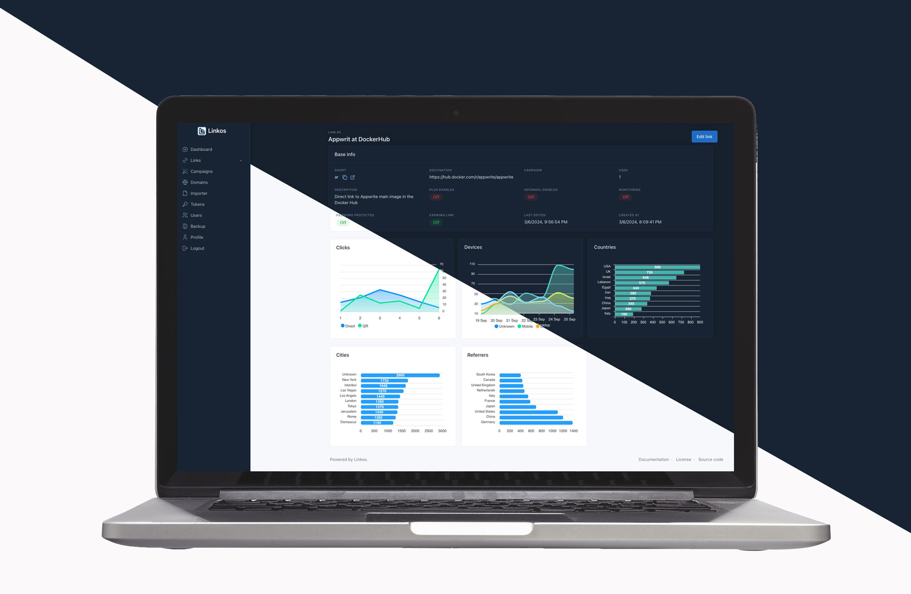

Fully featured Open-source URL Shortener

> [!NOTE]  
> This project is still in development    
> We would love you to tag along,   
> Click [here](https://github.com/byawitz/linkos/wiki/Development-phases) to see the development planned process.
>
> | 🏗️ Current | 👉 Next |
> |-------------|---------|
> | Pre-alpha   | Alpha   |

## Architecture

## Stack:

| What          | Tech                                                                                        |
|---------------|---------------------------------------------------------------------------------------------|
| Backend       | [Bun](https://bun.sh), [Hono](https://hono.dev)                                             |
| Links DB      | [PostgreSQL](https://www.postgresql.org/)                                                   |
| OLAP DB       | [ClickHouse](https://clickhouse.com/)                                                       |
| Message Queue | [Kafka](https://kafka.apache.org/) + [KRaft](https://kafka.apache.org/documentation/#kraft) |
| Cache         | [Redis](https://redis.io/)                                                                  |
| Frontend      | [Vue](https://vuejs.org/) with [Tabler](https://tabler.io) theme                            |
| Extension     | [Vue](https://vuejs.org/) with [WXT](https://wxt.dev/)                                      |
| Cronjob       | [Croner](https://github.com/hexagon/croner)                                                 |
| Realtime      | [Soketi](https://docs.soketi.app/)                                                          |

#### Notes:

- _For SSL use either Nginx & certbot, or any domain-level SSL as Cloudflare._

## Features:

| Feature                 | Description                                                                                                                                                              | Quota / Notes |
|-------------------------|--------------------------------------------------------------------------------------------------------------------------------------------------------------------------|---------------|
| Short links             | Number of links can be created each month                                                                                                                                | Unlimited     |
| Campaign                | Create and manage links by campaigns and get stats for campaign in general                                                                                               | Unlimited     |
| Redirect link           | Changing link destination                                                                                                                                                | Unlimited     |
| Custom URI              | Set your own short link hash                                                                                                                                             | Unlimited     |
| Custom domain           | Set custom domain for your links                                                                                                                                         | Unlimited     |
| Clicks                  | How many time each link can be clicked                                                                                                                                   | Unlimited     |
| QR                      | Generate branded link QR code                                                                                                                                            | Unlimited     |
| Private                 | Private links protected with password                                                                                                                                    | Unlimited     |
| Expiration              | Make link expire in N time                                                                                                                                               | Unlimited     |
| I Redirect              | Redirect with **info** and `Continue` button                                                                                                                             | Unlimited     |
| Plus page               | Behind the link page.                                                                                                                                                    | Unlimited     |
| Webhooks                | Get notified when click, goal oriented Meaning every X clicks, etc.                                                                                                  | Unlimited     |
| Device targeting        | Target link by device type, brand.                                                                                                                                       | Unlimited     |
| Geo targeting           | Geo targeting by [ip-db](https://github.com/sapics/ip-location-db)                                                                                                       | Unlimited     |
| Tags                    | Organize links by tags.                                                                                                                                                  | Unlimited     |
| Users                   | Multiple users.                                                                                                                                                          | Unlimited     |
| CSV/Bulk                | Short a big list of URLs                                                                                                                                                 | 10,000+       |
| Analytics               | Comprehensive link analytics, look below                                                                                                                                 | 3 Years       |
| Monitor                 | Monitor links like uptime robot                                                                                                                                          | Hourly        |
| UTM Builder & Forwarder | Easy UTM builder and forward the UTM data                                                                                                                                | ✅             |
| Parameter passing       | Pass all other parameters                                                                                                                                                | ✅             |
| API                     | The same API being used by the dashboard but with a Token                                                                                                                | ✅             |
| Backup                  | Easy automate backup to any S3-compatible storage                                                                                                                        | ✅             |
| OAuth2 login            | For now Google, Apple & Facebook                                                                                                                                         | ✅             |
| 2FA                     | Enable 2fa with SMS (Plivo, Twilio) and OTPT                                                                                                                             | ✅             |
| Easy firewalling        | For easy endpoint firewalling all api would be behind `/v1/api` endpoint And, all management would be behind `admin` endpoint and it's changeable in the `.env` file | ✅             |
| GDPR, CCPA, PECR        | Compliance with GPDT, CCPA and PECR.                                                                                                                                     | ✅             |
| SSO/SAML                | Azure AD, Google Workspace.                                                                                                                                              | Later         |

### Analytics

| Feature  | Description                                                                                                            |
|----------|------------------------------------------------------------------------------------------------------------------------|
| Clicks   | Number of clicks                                                                                                       |
| QR scans | How many times the link was accessed through the QR code it will work as links with QR code have a `qr` in the URL |
| Country  | Country origin                                                                                                         |
| Device   | Device type, and brand                                                                                                 |
| Referrer | URL referrer                                                                                                           |

## Deploying

| Container    | Description         |                  Notes |
|--------------|---------------------|-----------------------:|
| Traefik      | Application Proxy   | Standalone application |
| Postgres     | Clicks DB           | Standalone application |
| ClickHouse   | OLAP DB             | Standalone application |
| Redis        | Cache DB            | Standalone application |
| Kafka        | Message Queue       | Standalone application |
| Linkos       | A stateless backend |        API & Dashboard |
| Linkos Links | Links entrypoint    |               Provider |
| Analytics    | Kafka consumer      |                 Worker |
| Webhooks     | Kafka consumer      |                 Worker |
| Scheduler    | Cron                |                 Runner |

As the backend is stateless horizontal scaling is very easy.